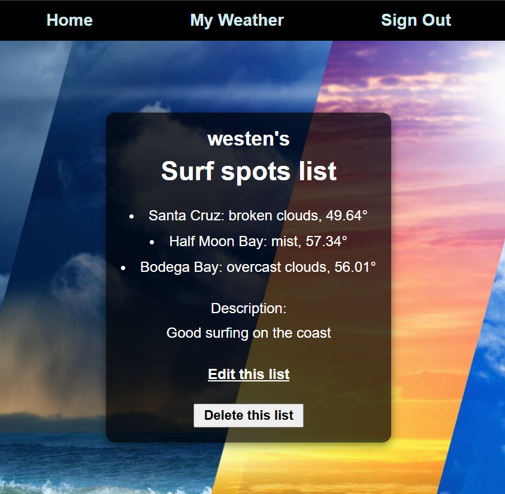

Next Steps: Planned future enhancements (stretch goals).

# Weather App
### Create lists of locations, and check the weather for those locations

## Background
I wanted to integrate some kind of external source of information into my site, and APIs were the obvious method of doing so in the context of the material we have covered this unit and the parameters for this project. I love outdoor sports and activities, so my life revolves significantly around weather. I love websites like Windy and OpenSnow, and I have some ideas for developing a weather focused website of my own. I felt a project like this, though very simple, would be a good opportunity to explore the functionality of weather related web services.

## Link
https://ga-weather-app-455e77fe28aa.herokuapp.com/

## Capabilities
* Check the weather for american zip codes
* Make a list of locations
* View weather for all locations in list at once
* Edit list name, description, and locations of a list
* Delete a list

## Attributions
OpenWeather API

## Technologies
* JavaScript
* HTML
* CSS
* EJS
* Express.js
* Node.js
* MongoDB
* Mongoose
* Session
* MethodOverride
* MongoStore
* Github
* API

## Future
* More complex API integration (location entry, returned data)
* external database integration

